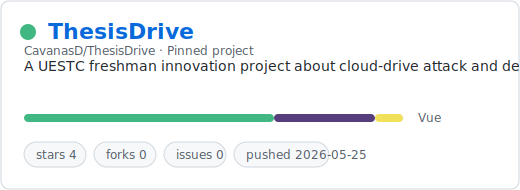
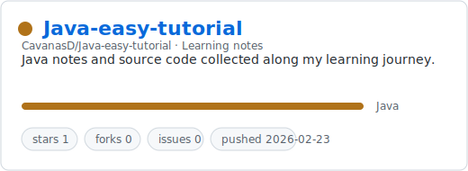
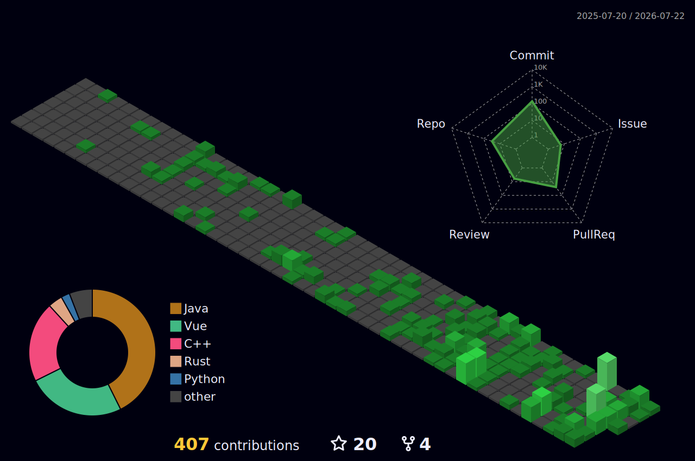

<p align="center"></p>
<p align="center"></p>

<div align="center">
  

  <p>
    <a href="https://n1n3bird.top">
      
    </a>
    <a href="mailto:n1n3bird@163.com">
      
    </a>
    
  </p>
</div>

### About Me

Android Mobile Security | Firmware Security | CTF Binary: Reverse / Pwn

University of Electronic Science and Technology of China | [@YulinSec](https://github.com/YulinSec)

Learning security through mobile internals, firmware research, reverse engineering, pwn, and CTF practice.

### Pinned Project

<a href="https://github.com/CavanasD/ThesisDrive">
  <picture>
    <source media="(prefers-color-scheme: dark)" srcset="./.github/cards/thesisdrive-dark.svg">
    <source media="(prefers-color-scheme: light)" srcset="./.github/cards/thesisdrive-light.svg">
    
  </picture>
</a>

### Notes

These are notes from my learning journey, and I keep updating them in my spare time.

<a href="https://github.com/CavanasD/Java-easy-tutorial">
  <picture>
    <source media="(prefers-color-scheme: dark)" srcset="./.github/cards/java-easy-tutorial-dark.svg">
    <source media="(prefers-color-scheme: light)" srcset="./.github/cards/java-easy-tutorial-light.svg">
    
  </picture>
</a>

### Skills

**Languages**

<p>
  
</p>

**Mobile, Binary, and Systems**

<p>
  
</p>

<sub>Yes, I use Arch btw.</sub>

**Web and Frontend**

<p>
  
</p>

**Tooling**

<p>
  
</p>

### 3D Green Wall

<p align="center">
  
</p>

### Public Key

<details>
<summary>PGP public key for n1n3bird@163.com</summary>

```text
Fingerprint: F8BD 0866 4F75 AC8F CA1C 7443 0A65 0A1C 4CE2 7AD6

-----BEGIN PGP PUBLIC KEY BLOCK-----

mDMEakzyLRYJKwYBBAHaRw8BAQdA50rEhlSN5HF7NYgKctZdwQYRuzSUXNXBei3T
vZ9ItHy0G24xbjNiaXJkIDxuMW4zYmlyZEAxNjMuY29tPoiZBBMWCgBBFiEE+L0I
Zk91rI/KHHRDCmUKHEzietYFAmpM8i0CGwMFCQPCZwAFCwkIBwICIgIGFQoJCAsC
BBYCAwECHgcCF4AACgkQCmUKHEzietYddAEA0ZIjxoVvehxnsa9QYII4XbZdp4Oz
X3JISWVv4Tu32o0A/irSpLMLuXJHUlvsfIU7lqGE1G/8NaQ1YYIjXOw14FkMuDgE
akzyQBIKKwYBBAGXVQEFAQEHQJ/vM/S/Z6T81hQErYhWkraW0igQPCPtaG1QiAcD
LrkFAwEIB4h+BBgWCgAmFiEE+L0IZk91rI/KHHRDCmUKHEzietYFAmpM8kACGwwF
CQPCZwAACgkQCmUKHEzietbDXgD6AnwzPOajZC4DWZyF3UXmn2Wb7vEEVWI88ARG
SXfoI1oA/jFa31he+G9GHvxWLWNfzeLQNS1zj1mQSxyVa7dB/P4A
=znf6
-----END PGP PUBLIC KEY BLOCK-----
```

</details>

<p align="center">
  <picture>
    <source media="(prefers-color-scheme: dark)" srcset="./.github/motto-calligraphy-dark.svg">
    <source media="(prefers-color-scheme: light)" srcset="./.github/motto-calligraphy-light.svg">
    
  </picture>
</p>
